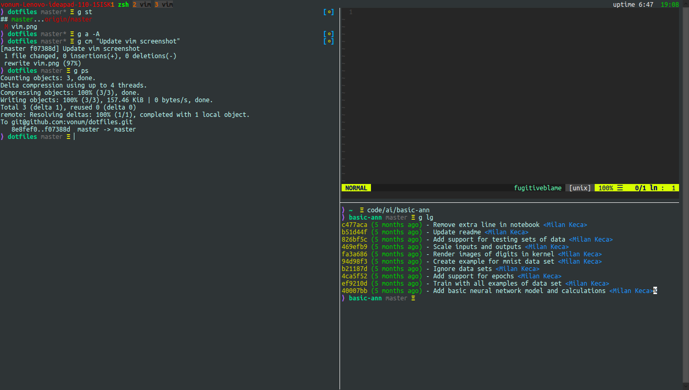
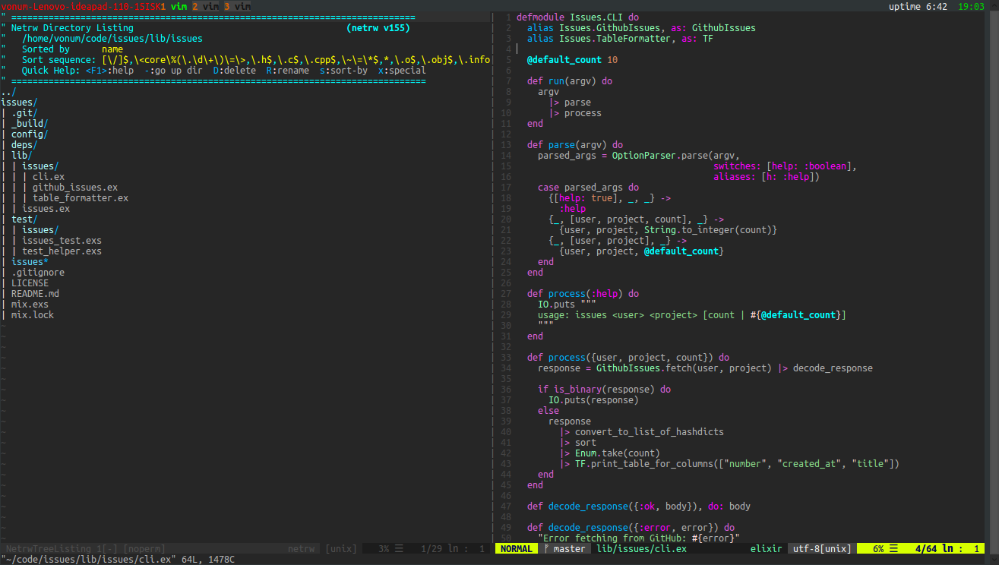

# Dotfiles

Simple dotfiles containing:
- aliases
- zshrc
- vimrc
- tmux.conf
- prompt
- gitconfig

### zsh and tmux


### Vim


### Requirments

- zsh
- vundle
- tmux

### Installation

```
git clone https://github.com/vonum/dotfiles ~/dotfiles

cd ~/dotfiles

./install
```
