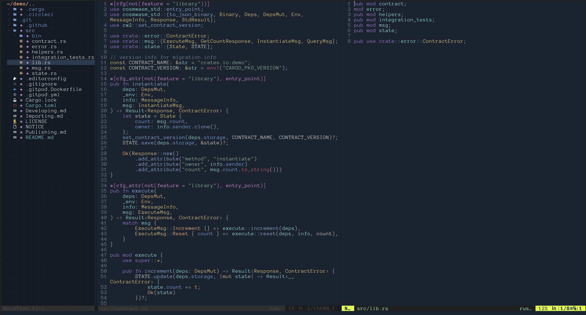
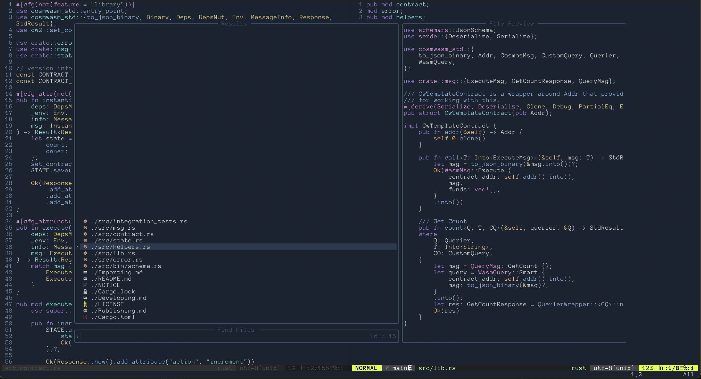

# Dotfiles

Simple dotfiles containing:
- aliases
- zshrc
- vimrc
- tmux.conf
- gitconfig

### zsh and tmux


### Neovim




### Requirments
- zsh
- ohmyzsh
- spaceship prompt
- tmux
- nvim

### Installation
```
git clone https://github.com/vonum/dotfiles ~/dotfiles

cd ~/dotfiles

./install
```
